# TerrainTronics-Conwy-Castle

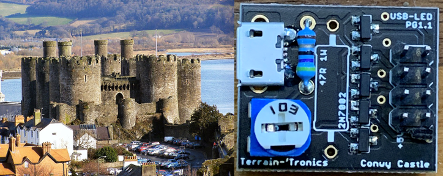

## Introduction
The Castle Conwy board is designed to drive 4 LED’s on your terrain from a USB Power Bank, Battery pack, Wall Wart or Lithium Ion Cell.
It drives all 4 LED’s with a adjustable constant current, ensuring that you get the same brightness from all 4 LED’s with the turn of a single trimmer.
An installable power resistor (in the package) can be soldered on to the board to make sure your USB Power Bank stays powered on. For all other power sources, the Power Resistor is not required.
In the pack are two Conwy boards, a pair of Power Resistors (if needed) and a little solder to get the job done.
All Terrain Tronics boards are named after various sites of historical interest in Wales, UK. Edward Ist and his architect Master James of St George built both castle and walls in a barely believable four years between 1283 and 1287. Conwy takes its place alongside Edward’s other great castles at Beaumaris, Harlech and Caernarfon as a World Heritage Site.

 
## LED 101 – LED’s for Dummies. 
### Read this. Please. It will make the rest of this guide easier.

### Vocabulary
- Think of **Voltage** like water pressure. The higher the voltage, the more “push” there is.
- Think of **Current** like the amount of water flowing per second.
- Think of **Resistance** like a water pipe. The smaller the diameter, the more resistance on the current. For the same pressure, a smaller pipe will allow less water to flow.
Battery – A battery can be thought of like a water pump. It adds pressure to the system. (e.g a 9V battery adds 9V of pressure to all the electrons flowing through the wires). Batteries also have a capacity – an amount it can push. 

- Load – A descriptive term for the amount of power drawn by the circuit. A single LED would be a small or low load. A toaster oven would draw a lot of power, and be thought of as a big/high load. To a USB Power Bank, an LED is such a low load that many of them auto-shutoff.
- LED’s are typically 2 pin devices that turn electrical energy into light. The long leg is called an ANODE and connects to the highest voltage in your product (for example, the 5V+ from USB) and the short leg is called a CATHODE and connects to the most negative voltage.

On Conwy Castle boards, a transistor sits between the Cathode and 0V and behaves as a smart resistor, changing its value to make sure not more than the programmed current flows. (see Schematic and Theory of Operation for more Nerdly details!)

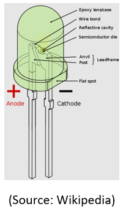

### To function normally, LED’s need a few things 
- High enough VOLTAGE across them, to switch them on. 

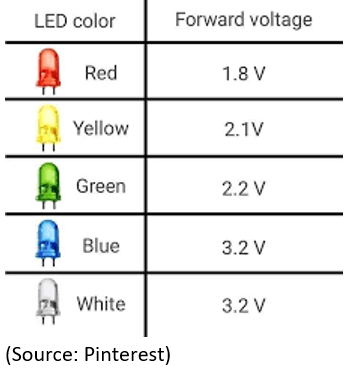
- Current limiting, because once they switch on, they look like a short circuit and will burn up without something to limit the current.
- Wired the right way ‘round. The long leg goes to the positive side of your circuit, and short side goes to the negative. Wiring them in backwards will mean they won’t light up, but they should not be damaged.

Most LED’s need to be limited to about 20mA (milli Amps – that’s one thousandths of an Amp!). Any more than this, and your common 5mm diameter LED will burn up and fail.

The LED’s used in your room lights etc can tolerate higher Currents, and shine brighter, but ultimately, they are still low voltage devices.
For more on Voltage and Current, check out this video: https://youtu.be/mFjnooXosdU

## LED's are normally wired with a resistor!

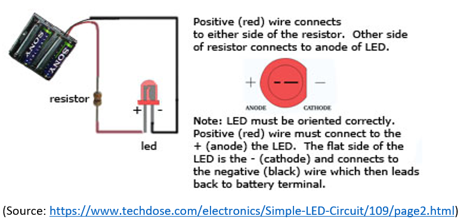

Conwy Castle board does a clever trick and replaces the resistor with a transistor that is externally controlled, so that 4 channels are controlled together. (see Schematic and Theory of operation)

## LED Brightness vs Current
LED brightness is measured in Millicandela. LED’s are specified for Millicandela (mcd) at 20mA typically. An Orange and Green LED, if they are both specified for 2000mcd @ 20mA will be equally as bright if you drive the same current through them, even though they drop a different voltage.
 
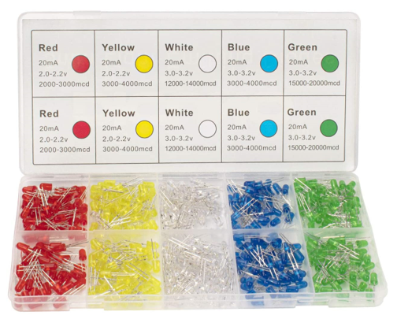
In the kit above, you can see that the yellow and blue will be perfectly matched with 20mA, and the Red will be pretty close too! However, Green and White will be quite a bit brighter and would be better driven from a different Conwy board.
**THAT** is why we prefer to drive LED’s with constant current circuits, not constant voltage.

## Connecting LED’s to the Conwy Castle board

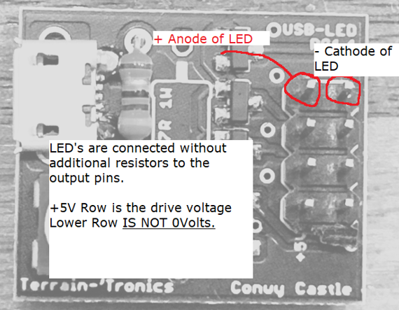

Conwy Castle uses standard 0.1” / 2.54mm pitch header pins to connect to LED’s. As the current limiting component is actually integrated in the board you only need to connect the two pins directly to the LED. The board takes care of the current limiting and the brightness control.
Connection can be done with a wire wrapping tool, Soldering or Dupont Jumper wires.
I rather like wire wrap for this part of the board, as it’s a strong connection, easily done away from the workbench without a soldering iron, and frankly, if they can send a person to space using wire-wrap technology, then we can build terrain with it.

## Power Supply Options
### USB Wall power and USB Power Banks
Conwy comes with a Micro-USB connector already on it. This should be enough to drive all LED types. However, most LED’s don’t pull enough power to keep USB Power Banks switched on. (they think there’s nothing to power, so they go to sleep). This can be solved by soldering in one of the power resistors included in the pack.
Most USB Wall Powered units don’t do this. So this resistor can be omitted. In use, the Resistor will become warm, as it is dissipating 1/2W of power.
In the pack should be two resistors and some solder, just in case you don’t have any to hand.

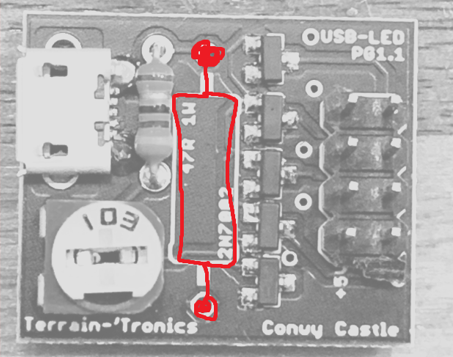

### Alkaline Battery Packs
AA and AAA battery packs are quite common in terrain building. Some of them even come with power switches integrated into them. For use with LED’s it’s suggested to use 3 Alkaline batteries in Series (so that the total voltage is 3x 1.5V = 4.5V). White and Blue LED’s need more than 3V to function.

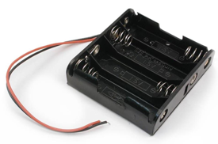

As such, 2x AA or AAA batteries will struggle to light them up. For applications with other colors, it is possible that 2x AA batteries could be used – be sure to test on your bench first!
AA batteries will typically have about 2000mAH of capacity. If your LED’s are pulling 10mA each, then you should be able to get <200 hours for an LED. Divide down as you add more LED’s or draw more current.
Wiring a battery pack into the Conwy Castle board is quite easy. Solder the RED + from the pack to one side of the Power Resistor footprint, and wire the BLACK – to the other side as shown in the diagram below.

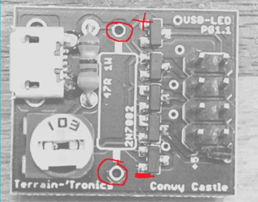

### Coin Cell Batteries
CR2032 batteries are quite common in “Throwies” and electronic tea lights. These are simple circuits, where the brightness of the LED is set by the battery itself. CR2032 batteries are limited in the amount of current they can output. This current limit helps with LED’s.
However, where they fall apart is when you try to drive multiple LED’s in parallel. The inbuilt resistance in them limits the current to be delivered to the LED’s.

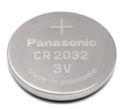
 
### Lithium Ion Batteries

Lithium Ion batteries typically come in two types. Protected and Unprotected variants. These are typically 3.7V, and require a special circuit to protect them (this is usually on the battery). These batteries have a lot of power capacity in a small space. Care should be taken not to puncture them or expose them to high temperatures.
•	They require special charging circuits to charge from USB. (search Amazon for TP4056 Charger)
•	Protection Circuits prevent overheating/explosions caused by short circuits or the battery running too low. We love protection circuits. Some charging boards come with them integrated too. 2 circuits are even better than 1!

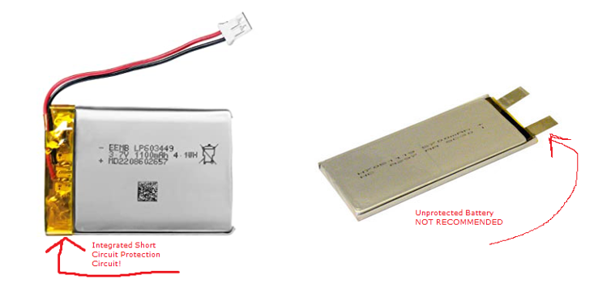

Hooking up a battery, charger circuit and a Conwy castle board can be seen below
 
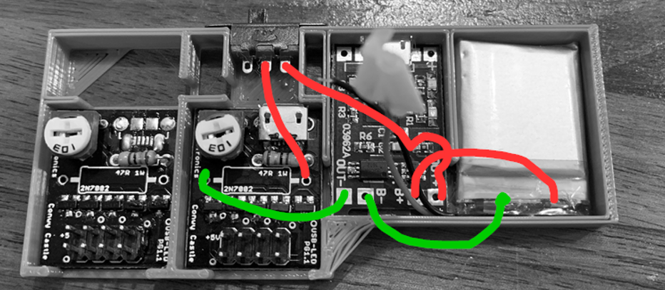
•	The battery is only connected to the charge board. It should be connected to the B+ and B- points. 
•	Out+ from the charger board goes to one side of the switch. 
•	The Common (middle) pin of the switch then goes to the + side of the resistor footprint on the Conwy board. 
•	OUT- from the charger board goes to the Negative side of the board.

Multiple Conwy boards can share the same OUT+ and OUT- from the charger board.
The big resistor typically used for USB Power Bank’s isn’t required with lithium ion batteries. They continue to provide power, even if the amount of current being drawn it low.

## Adding a switch

### USB
In the USB Powerbank use case, many of them already come with a switch, if not – I’m really quite fond of these in-line switch cables. Available on Amazon.

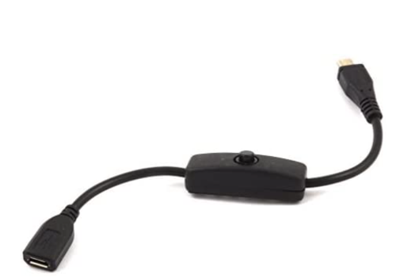
 
### Battery Packs (Alkaline, Lithium Ion, Coincell etc)
For battery packs without the included switch, I’m quite fond of simple slide switches. (Amazon search “Slide switch solder lug”. They are easily sourced, reliable and easy to solder to. The holes and shape allow them to be mounted to 3d printed frames easily. 
 
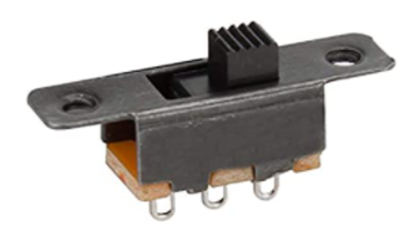
 
## Schematic and Theory of Operation
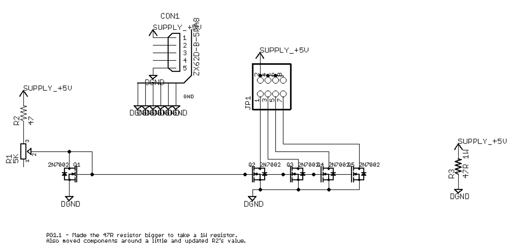
The board functions a current source and 4 current mirrors.
R1,R2 and Q1 sets the reference current in the circuit.
Q2 through Q5 then mirror that current if they can. So an LED connected between the +5V (or your battery positive voltage) and the Drain (the top) of the transistor Q2-Q5 will switch on, then only allow the same amount of current through it that goes through Q1. E.g. if Q1 is set up for 10mA, then regardless of the color of the LED, only 10mA will be passed through it.

As mentioned in section 1 – each color LED drops a different voltage, but many are rated for the same brightness at a specific current. 
 
 

